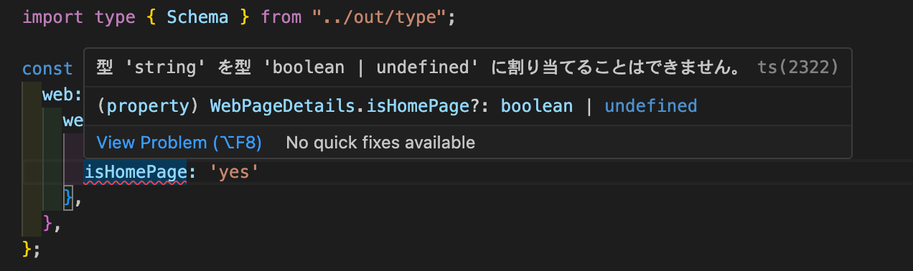
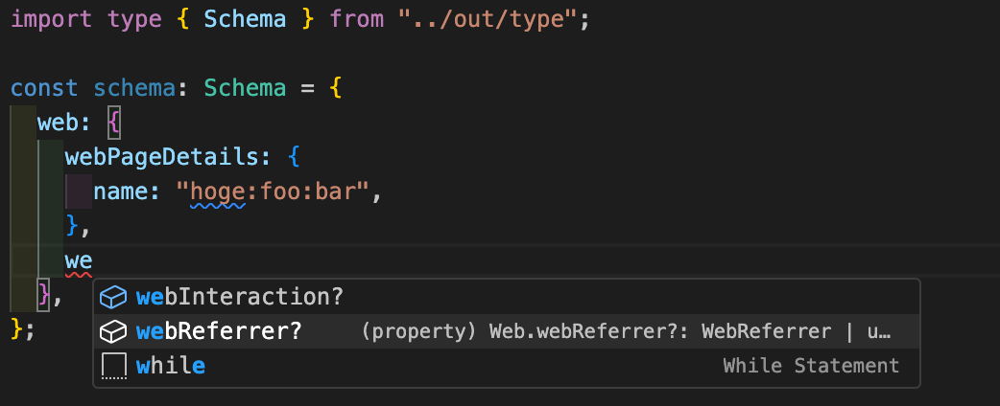

# Overview

This tool is a script that converts Adobe Experience Platform's XDM schema into TypeScript types.
By using this tool, you can leverage XDM in a type-safe manner, avoiding input of information that doesn't conform to the schema.
This minimizes potential bugs and enhances the overall robustness of your code.

> **Warning**  
> This tool is an unofficial Adobe tool. Please note that if the DOM structure of the Schema page changes, there is a possibility that the tool may not function correctly

# Requirement

It is recommended to have the following versions installed:

- Node.js: ^18.16.1
- npm: ^9.5.1

# Install

Run the following command.

```shell
npm run install
```

# Setup

To set up and use the tool, follow these steps:

1. Open the page of the schema for which you want to create types.
2. Open the developer tools console.
3. Execute the following command to build scraping script.

```shell
npm run build
```

4. A file named `dist/index.js` will be generated. Copy the code from that file.
5. Paste the copied code into the console and execute it.
6. An object will be outputted to the console. Copy that object.
7. Paste the copied object into a file named `input/data.json` and save it.
8. Run the following command to generate the type.

```shell
npm run generate
```

9. The generated type will be available in the file `out/type.ts`. Use it in your typescript code!

That's it! You're all set to use the tool and enjoy the benefits of type safety with XDM schemas.
If you have any questions or encounter any issues, feel free to reach out to me. I'm here to help!💪

# Usage

By using the generated type, you will receive an error if you try to input a field that does not exist in the schema.

```typescript
import type { Schema } from "../out/type";

const schema: Schema = {
  web: {
    webPageDetails: {
      name: "hoge:foo:bar",
      isHomePage: "yes",
    },
  },
};
```



Additionally, the tool provides suggestions while entering field names, which helps reduce your working time.



Looking forward to seeing your code shine with enhanced reliability and fewer bugs. Happy coding!🎉🎉🎉
